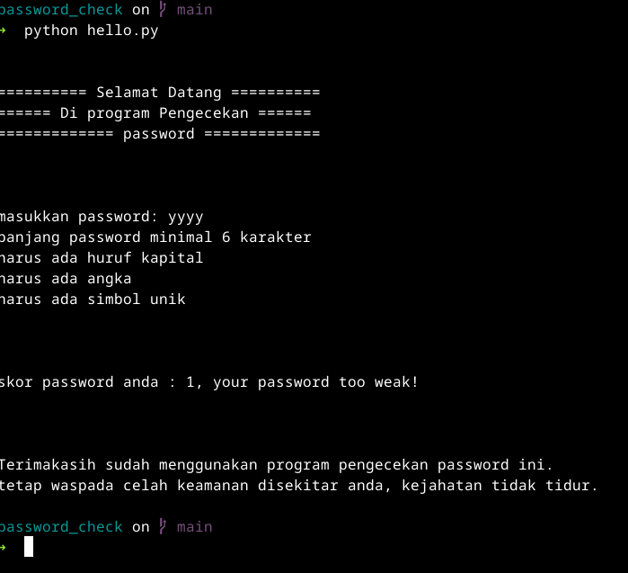
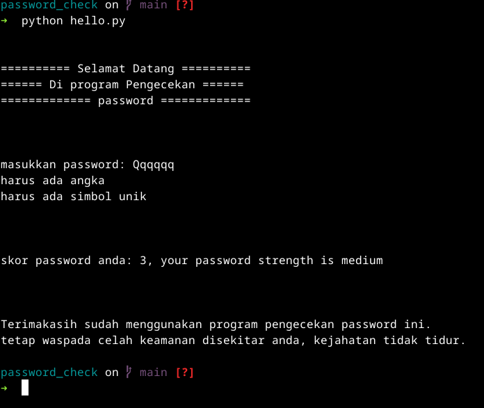
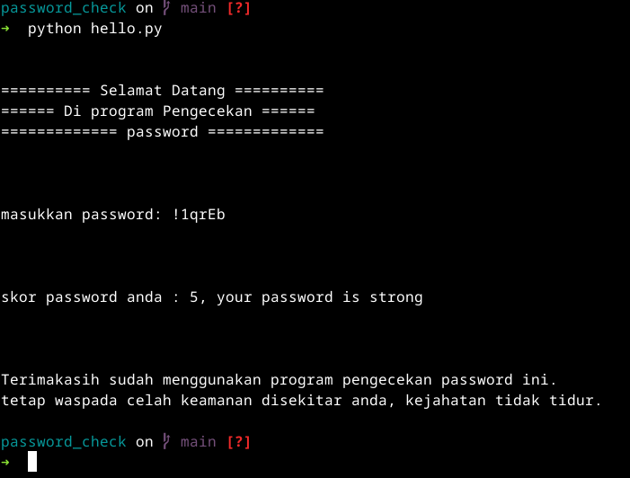

# benice - Password Strength Checker

<p align="center">
  
</p>

`benice` is a simple command-line interface (CLI) program written in Python to check the strength of a password.

## Features

`benice` checks for the following criteria to determine password strength:

-   At least one uppercase letter (`A-Z`).
-   At least one lowercase letter (`a-z`).
-   At least one number (`0-9`).
-   At least one special symbol (e.g., `!@#$%^&*()`).
-   A minimum length of 6 characters.

## How to Run

1.  Make sure you have Python installed on your system.
2.  Open your terminal or command prompt.
3.  Navigate to the directory where `hello.py` is located.
4.  Run the following command:

    ```bash
    python hello.py
    ```

5.  The program will prompt you to enter a password for evaluation.

## Scoring

The program uses a scoring system to evaluate the password's strength. The initial score is 5. For each of the following conditions that is not met, the score is reduced by 1:

-   Password length is less than or equal to 5 characters.
-   No uppercase letters are found.
-   No lowercase letters are found.
-   No numbers are found.
-   No special symbols are found.

## Password Strength Levels

Based on the final score, the password strength is categorized into one of three levels:

-   **Weak:** Score of 2 or less.
    <p align="center">
        
    </p>
-   **Medium:** Score of 3.
    <p align="center">
        
    </p>
-   **Strong:** Score of 4 or 5.
    <p align="center">
        
    </p>
